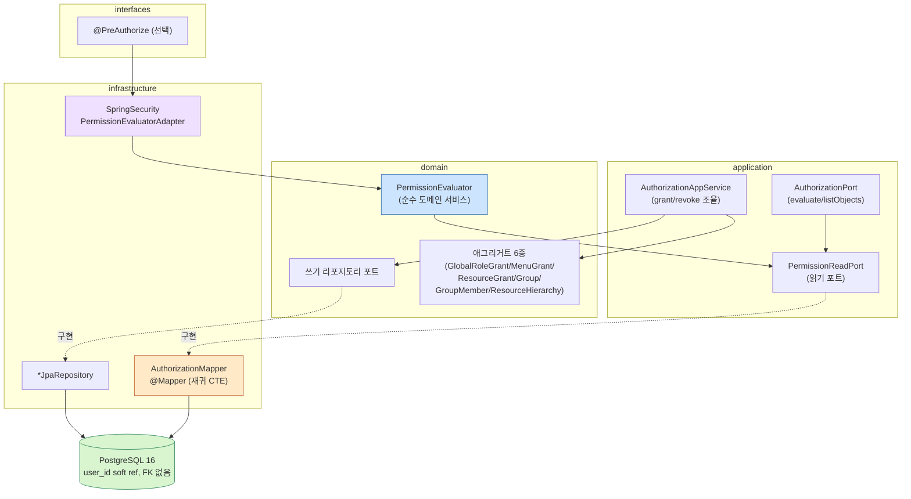

# Phase 4: Authorization 컨텍스트 - Research

**Researched:** 2026-05-31
**Domain:** 3계층 권한(전역 역할/메뉴/리소스) + 그룹·리소스 계층 상속 + PermissionEvaluator 통합 판정 + AuthorizationPort/Postgres 어댑터
**Confidence:** HIGH (스택·게이트·재귀 CTE·Spring Security 인터페이스 시그니처를 실 classpath 바이트코드·실 Postgres 문법으로 실측)

> **lesson 03 P1 준수 선언:** 이 RESEARCH의 모든 "프레임워크 기본/Postgres 기본 동작" 주장은 추정이 아니라
> 실 classpath jar 바이트코드(`javap`)·실 소스 jar·PostgreSQL 공식 문서로 실측했다. 특히 **Spring
> Security `PermissionEvaluator` 인터페이스 시그니처에 대한 CONTEXT의 진술은 틀렸고**(아래 §PermissionEvaluator
> 충돌에서 정정), 베이스라인 의존 버전도 objective가 명시한 "6.5"가 아니라 **6.5.1**임을 jar로 확인했다.

---

## User Constraints (from CONTEXT.md)

> CONTEXT.md(04-CONTEXT.md)가 존재하므로 이 절이 첫 내용 절이다. planner는 아래 잠금 결정을 위반하는 설계를 제안하지 않는다.

### Locked Decisions (D-01 ~ D-11)

- **D-01:** 권한 코드는 신규 `com.anchors.baseline.authorization.{domain,application,infrastructure,interfaces}` 컨텍스트. 애그리거트·VO·쓰기 포트·`PermissionEvaluator`(순수 도메인 서비스)·`AuthorizationPort` → domain 또는 application. **MyBatis 읽기 포트 → application, `@Mapper` 구현 → infrastructure/mybatis. JPA 쓰기 어댑터 → infrastructure/jpa. AuthorizationPort Postgres 어댑터 → infrastructure.**
- **D-02:** `Application`은 `Domain`만 접근(`mayOnlyAccessLayers("Domain")`). `PermissionEvaluator`/`AuthorizationPort`가 JPA/MyBatis 어댑터를 직접 참조하면 빌드 RED. 포트만 의존, 구현은 infrastructure. 신규 패키지 추가 후 `./gradlew test --tests *ArchitectureTest*`로 계층 정합 실증(lesson 01 P1).
- **D-03:** `PermissionEvaluator`는 **순수 도메인 서비스**(`evaluate(userId, resource, action)`). Spring Security의 동명 인터페이스는 **직접 구현하지 않는다**(도메인을 framework에 오염시키지 않음 — A-4). Spring 통합이 필요하면 `authorization/infrastructure`에 얇은 어댑터(권장명 `SpringSecurityPermissionEvaluatorAdapter`). MethodSecurity 어댑터 포함 여부는 planner 판단(SC#1·#2는 도메인 `evaluate()` 직접 호출로 검증 가능).
- **D-04:** `AuthorizationPort`는 판정·조회의 추상 경계. 최소 연산: `evaluate(userId, resource, action) → boolean`, `listObjects(userId, action) → List<리소스ID>`. **부여/회수는 포트에 넣지 않고 앱 내부 도메인 애그리거트 쓰기(JPA)로 처리**(권장). `write(tuple)`을 포트에 두는 외부 엔진 우선 설계는 비채택.
- **D-05:** 합산·상속 조회는 MyBatis 읽기 모델(재귀 CTE), 판정 규칙(역할 함의·합산)은 도메인 서비스. JPA로 재귀 트리 로드 금지. evaluate = (직접 부여) ∪ (소속 그룹 부여) ∪ (조상 리소스 상속). 역할 함의(EDITOR ⊇ VIEW)는 도메인 서비스에 캡슐화. 함의 표현(enum/테이블)은 planner 재량.
- **D-06:** 즉시 반영(SC#1) = **매 evaluate 호출 시 DB 조회(캐시 없음)**. Redis/로컬 캐시 미도입(NFR-01·lesson 03 미검증 최적화 금지).
- **D-07:** Authorization은 Identity `User`를 **로컬 PK(`userId: Long`)로만** 참조. 권한 테이블은 `user_id BIGINT`를 갖되 **identity `users`로의 물리 FK 없음(soft reference)**. INVITED→ACTIVE 전이는 Authorization 데이터에 영향 없음 → SC#4가 추가 코드 없이 충족. FK 추가를 원하면 planner가 §4.1 트레이드오프 명시 후 결정(베이스라인 권장은 FK 없음).
- **D-08:** Flyway `V3__create_authorization.sql`. 테이블 윤곽은 도메인 모델에서 역산(테이블 우선 금지). 네이밍 규약: `BIGSERIAL PRIMARY KEY`, `TIMESTAMP WITH TIME ZONE DEFAULT now()`, 테이블 `COMMENT`.
- **D-09:** JPA 방식 A(엔티티=애그리거트). **`created_at` 이중 소스**(엔티티 `Instant.now()` + DDL `DEFAULT now()`)는 lesson 02 P2 미해소 패턴. Phase 4 신규 엔티티가 동일 패턴을 따를지 단일화할지 planner **명시 결정**.
- **D-10:** Testcontainers(PostgreSQL) + 통합 테스트. 재귀 CTE는 실 Postgres에서만 정확 → H2 등 대체 금지. `AbstractIntegrationTest` 상속. SC#1~5 행위 단언.
- **D-11:** **신규 외부 의존 추가 없음.** MyBatis·JPA·Postgres·Testcontainers·Spring Security 이미 존재. OpenFGA SDK 등 외부 엔진 의존 추가 금지.

### Claude's Discretion (planner/researcher 재량)
애그리거트별 VO·필드(`RoleName`/`Action`/`ResourceId` VO), 역할 함의 자료구조(enum/테이블), MyBatis 표현(`@Select` vs XML — 재귀 CTE는 XML 가독성 유리), 주체(user/group) polymorphic vs 분리 테이블, `evaluate` 결과 타입(boolean vs 결정 사유), Spring Security 어댑터 포함 여부, wave 분할(선형 권장), 예외 계층 — 모두 §5.4·§4.5·SC·ArchUnit·NFR 위반 없는 선에서 재량.

### Deferred Ideas (OUT OF SCOPE)
외부 인가 엔진(OpenFGA) 어댑터 + ACL + dual-write / 권한 평가 캐시(Redis/로컬) + 무효화 / `UserDisabled` 이벤트 구독 권한 정리 / Spring Security MethodSecurity 어댑터(선택) / REST 관리자 API/UI / `UserActivated` 이벤트 기반 활성화 / `created_at` 이중 소스 베이스라인 전체 일괄 단일화.

---

<phase_requirements>
## Phase Requirements

| ID | Description | Research Support |
|----|-------------|------------------|
| AUTHZ-01 | 전역 역할 부여/회수 | §Standard Stack(JPA 방식 A 애그리거트), §Code Examples(GlobalRoleGrant 엔티티 + JpaRepository 포트/어댑터) |
| AUTHZ-02 | 사용자/그룹 메뉴 권한 부여/회수(MenuGrant) | §Architecture(작은 애그리거트), §Pitfall(주체 polymorphic vs 분리) |
| AUTHZ-03 | 사용자/그룹 리소스 권한 부여/회수(ResourceGrant) | §Code Examples(ResourceGrant 애그리거트) |
| AUTHZ-04 | 그룹 생성·가입/탈퇴(Group/GroupMember) | §Architecture(Group+GroupMember 다대다 ID 참조) |
| AUTHZ-05 | 리소스 계층 상속(ResourceHierarchy) | §Code Examples(WITH RECURSIVE + CYCLE 검증), §Pitfall(무한 루프 가드) |
| AUTHZ-06 | evaluate = 직접 ∪ 그룹 ∪ 상속 합산 판정 | §PermissionEvaluator, §Code Examples(union CTE), §Validation(진리표) |
| AUTHZ-07 | ListObjects 읽기 모델(재귀 CTE) | §Code Examples(listObjects CTE), §Don't Hand-Roll(재귀 CTE) |
| AUTHZ-08 | AuthorizationPort + Postgres 내부 어댑터(교체 가능) | §AuthorizationPort 경계, §Validation(SC#5 구조 단언) |
| AUTHZ-09 | INVITED 부여 권한 저장 + 로그인 시 효력 | §Cross-context soft ref, §Validation(SC#4 행위 단언) |
</phase_requirements>

## Summary

이 Phase는 정본 §5.4("가장 풍부한 도메인")의 worked example을 거의 그대로 구현한다. 핵심은 세 가지다.
첫째, **쓰기는 작은 JPA 애그리거트**(`GlobalRoleGrant`/`MenuGrant`/`ResourceGrant`/`Group`/`GroupMember`/
`ResourceHierarchy`), **읽기(합산 판정·계층 상속·ListObjects)는 MyBatis 재귀 CTE**로 명확히 가른다(CQRS-lite,
§4.5). 둘째, **`PermissionEvaluator`는 순수 도메인 서비스로 `evaluate(userId, resource, action)`**를 노출하며,
Spring Security의 동명 인터페이스(`hasPermission(...)`)와는 **시그니처가 다르므로 직접 구현하지 않는다**. 셋째,
크로스 컨텍스트 참조는 `userId: Long` soft reference(물리 FK 없음)라 INVITED→ACTIVE 전이가 Authorization
데이터에 무영향 → SC#4가 추가 코드 없이 충족된다.

가장 큰 함정은 **`PermissionEvaluator` 이름 충돌**이다. CONTEXT는 Spring 인터페이스가 `evaluate(Authentication,
target, permission)`이라 기술했으나 **실측 결과 실제 메서드명은 `hasPermission(...)`이다**(아래 정정). 둘은
시그니처가 완전히 달라 도메인 서비스가 우연히 Spring 인터페이스를 구현할 위험은 없지만, import 혼동·동명 클래스
혼란은 여전히 존재한다. 두 번째 함정은 **재귀 CTE 무한 루프**다 — `resource_hierarchy`에 사이클이 들어가면
`WITH RECURSIVE`가 무한 재귀하므로 `UNION`(중복 제거) 또는 PG14+ `CYCLE` 절로 방어해야 하며, 이는 실 Postgres
에서만 검증된다(H2 금지, D-10).

빌드 의존성 추가는 없다(D-11 확인). 모든 스택이 Phase 1~3에 이미 존재한다.

**Primary recommendation:** 정본 §5.4를 1차 설계 기준으로 삼아 6개 소형 JPA 애그리거트 + 1개 순수 도메인
`PermissionEvaluator` 서비스 + MyBatis 재귀 CTE 읽기 포트(application) ← `@Mapper`(infrastructure) +
`AuthorizationPort`(application, evaluate/listObjects만) ← Postgres 어댑터(infrastructure)로 구성하고,
`PermissionEvaluator`는 Spring Security 인터페이스와 절대 묶지 않는다. 캐시·외부 엔진·이벤트 구독은 전부 보류.

## Architectural Responsibility Map

| Capability | Primary Tier | Secondary Tier | Rationale |
|------------|-------------|----------------|-----------|
| 권한 부여/회수(grant/revoke) | API/Backend (JPA 애그리거트 쓰기) | — | 불변식 강제 = 애그리거트 책임(§4.5 쓰기 경로) |
| 통합 판정(evaluate) | API/Backend (도메인 서비스 + MyBatis 읽기) | — | 합산·역할 함의=도메인 서비스, 데이터 수집=읽기 모델(D-05) |
| 계층 상속 전개 | Database (Postgres 재귀 CTE) | API/Backend (MyBatis 매퍼) | "재귀 CTE 등 활용"=DB 책임(정본 §2), 매핑=infra |
| ListObjects | Database (재귀 CTE) | API/Backend (읽기 포트) | "내가 접근 가능한 X 목록"=읽기 모델(§4.5) |
| userId 참조 | API/Backend (soft ref, FK 없음) | — | 컨텍스트 독립(§4.1, D-07) |
| Spring Security 연동(선택) | Frontend Server (MethodSecurity 어댑터) | API/Backend (도메인 evaluate 위임) | framework 결합=infra 와이어링(D-03) |

## Standard Stack

신규 의존성 추가 없음(D-11). 아래는 **이미 classpath에 존재함을 jar로 실측**한 버전이다.

### Core
| Library | Version (실측) | Purpose | Why Standard |
|---------|------|---------|--------------|
| Spring Boot | 3.5.3 | 런타임·DI·트랜잭션 | 베이스라인 고정(§2) `[VERIFIED: gradle/libs.versions.toml]` |
| Spring Data JPA / Hibernate | hibernate-core **6.6.18.Final** | 권한 애그리거트 쓰기 | 방식 A 영속화(§4.4) `[VERIFIED: ~/.gradle/caches jar]` |
| MyBatis | mybatis-core **3.5.17** (via mybatis-spring-boot-starter **3.0.4**, mybatis-spring **3.0.4**) | 재귀 CTE 읽기 모델 | 복잡 조회 SQL 제어(§4.5) `[VERIFIED: jar]` |
| PostgreSQL JDBC | **42.7.7** (driver), 컨테이너 `postgres:16` | 재귀 CTE 실행 | `WITH RECURSIVE` + `CYCLE`(PG14+) `[VERIFIED: jar + AbstractIntegrationTest]` |
| Spring Security | **6.5.1** (Boot 3.5.3 관리) | (선택) MethodSecurity 어댑터 | A-4 분리, 도메인은 미의존 `[VERIFIED: jar]` |
| Lombok | 1.18.38 | 보일러플레이트 | `[VERIFIED: libs.versions.toml]` |

> **버전 정정(objective vs 실측):** objective는 "Spring Security 6.5 / MyBatis 3.0.4 / Hibernate 6"라
> 했으나 실측 정확값은 **Spring Security 6.5.1**(Boot 3.5.3 관리 BOM), **mybatis-spring-boot 3.0.4 →
> mybatis-core 3.5.17**, **Hibernate 6.6.18.Final**. `~/.gradle/caches`에 spring-security 6.4.5 jar도
> 잔존하나 이는 과거 빌드 잔재이며 Boot 3.5.3 BOM이 6.5.1을 강제한다 `[VERIFIED: jar 양쪽 존재 확인]`.

### Supporting
| Library | Version | Purpose | When to Use |
|---------|---------|---------|-------------|
| Testcontainers postgresql | 1.21.x (Boot BOM) | 실 Postgres 재귀 CTE 검증 | D-10 모든 통합 테스트 `[VERIFIED: libs.versions.toml]` |
| Flyway core + database-postgresql | Boot 관리 | V3 권한 스키마 마이그레이션 | D-08 `[VERIFIED: build.gradle.kts]` |
| spring-boot-starter-test | Boot 관리 | `@SpringBootTest` 통합 | SC 행위 단언 `[VERIFIED: build.gradle.kts]` |

### Alternatives Considered
| Instead of | Could Use | Tradeoff |
|------------|-----------|----------|
| Postgres 재귀 CTE | OpenFGA 관계 튜플 | A-7 트립와이어 전까지 보류(Out of Scope). 외부 서버·dual-write 부담 |
| 매 호출 DB 조회 | Redis 권한 캐시 | 무효화 복잡도가 SC#1 위협, NFR-01 위반(D-06 비채택) |
| 도메인 `evaluate()` + 선택적 Spring 어댑터 | 도메인 서비스가 Spring `PermissionEvaluator` 직접 구현 | 도메인이 framework 오염(A-4 위반, ArchUnit RED) — 비채택 |
| MyBatis `@Select` 인라인 | MyBatis XML 매퍼 | 재귀 CTE는 다중 행·복잡 → XML 가독성 유리(planner 재량) |

**Installation:** 없음. `./gradlew dependencies`로 위 버전 재확인만(D-11).

**Version verification (실행 결과):**
```
spring-security-core: 6.5.1 (+ 잔재 6.4.5) [VERIFIED: find ~/.gradle/caches]
mybatis-spring: 3.0.4 → mybatis-core 3.5.17  [VERIFIED]
hibernate-core: 6.6.18.Final                  [VERIFIED]
postgresql JDBC: 42.7.7                        [VERIFIED]
PostgreSQL 컨테이너: postgres:16               [VERIFIED: AbstractIntegrationTest.java:33]
```

## Package Legitimacy Audit

> Phase 4는 **신규 외부 패키지를 설치하지 않는다**(D-11). 모든 라이브러리는 Phase 1~3에서 이미 검증·고정된
> Boot 관리 BOM 또는 Maven Central 안정판이다. slopcheck 대상(신규 설치) 없음 → 감사 불요.

| Package | Registry | 신규? | Disposition |
|---------|----------|------|-------------|
| (없음 — 신규 의존 추가 없음) | — | — | N/A |

**Packages removed due to slopcheck [SLOP] verdict:** none (신규 설치 없음)
**Packages flagged as suspicious [SUS]:** none

## Architecture Patterns

### System Architecture Diagram

쓰기 경로와 읽기 경로가 완전히 분리된다(CQRS-lite). 쓰기는 애그리거트로 불변식을 강제하고, 판정·조회는
도메인 서비스가 MyBatis 재귀 CTE 읽기 포트에서 데이터를 모아 역할 함의를 적용한다. 데이터는 다음처럼 흐른다:

```
[쓰기 — grant/revoke]
  AppService(authorization.application, @Transactional)
    → GlobalRoleGrant / MenuGrant / ResourceGrant / Group / GroupMember / ResourceHierarchy (도메인 애그리거트, JPA 방식 A)
      → *JpaRepository (infrastructure/jpa, 포트 구현)
        → Postgres (user_id BIGINT, FK 없음 — soft ref)

[판정 — evaluate(userId, resource, action)]
  PermissionEvaluator (authorization.domain.service, 순수)
    → PermissionReadPort (authorization.application, 읽기 포트)   ← 도메인 서비스가 이 포트만 의존
      → AuthorizationMapper (@Mapper, infrastructure/mybatis)
        → WITH RECURSIVE CTE: (직접 부여 ∪ 그룹 부여 ∪ 조상 리소스 상속)  → Postgres
    → 역할 함의(EDITOR ⊇ VIEW) 규칙 적용 → boolean

[조회 — listObjects(userId, action)]
  AuthorizationPort.listObjects (application 포트)
    → Postgres 어댑터(infrastructure) → 재귀 CTE → List<리소스ID>

[선택 — Spring Security 통합]
  @PreAuthorize → SpringSecurityPermissionEvaluatorAdapter.hasPermission(Authentication, target, perm)
    (infrastructure) → Authentication에서 BaselineOidcUser.userId 추출
      → 도메인 PermissionEvaluator.evaluate(userId, resource, action)  [framework→domain 위임, 게이트 허용]
```



### Recommended Project Structure
```
authorization/
├── domain/
│   ├── model/        # GlobalRoleGrant, MenuGrant, ResourceGrant, Group, GroupMember, ResourceHierarchy (JPA 방식 A 엔티티)
│   │                 # VO: RoleName, Action, ResourceId, MenuId (planner 재량)
│   ├── service/      # PermissionEvaluator (순수 도메인 서비스 — 역할 함의·합산 규칙)
│   └── repository/   # 쓰기 포트 (GlobalRoleGrantRepository 등) — UserRepository 형판
├── application/
│   ├── AuthorizationApplicationService (grant/revoke 조율, @Transactional)
│   ├── AuthorizationPort               # evaluate/listObjects 추상 경계 (SC#5)
│   ├── PermissionReadPort              # 재귀 CTE 읽기 포트 (SampleQuery 형판)
│   └── *Dto / *Projection             # 읽기 DTO (SampleDto 형판 — @NoArgsConstructor)
├── infrastructure/
│   ├── jpa/          # *JpaRepository (JpaRepository + 쓰기 포트, UserJpaRepository 형판)
│   ├── mybatis/      # AuthorizationMapper (@Mapper implements PermissionReadPort, 재귀 CTE)
│   ├── PostgresAuthorizationAdapter   # AuthorizationPort 구현 (읽기 포트/매퍼 위임)
│   └── security/     # (선택) SpringSecurityPermissionEvaluatorAdapter
└── interfaces/       # (베이스라인은 REST 권한 부여 화면 Out of Scope — 비어있을 수 있음)
```

### Pattern 1: MyBatis 읽기 포트/어댑터 (결정적 형판 — D-01·D-05)
**What:** 읽기 포트는 `application`, `@Mapper` 구현은 `infrastructure/mybatis`. Phase 1 `SampleQuery`←`SampleMapper`를 그대로 복제.
**When to use:** evaluate 합산 데이터 수집, listObjects, 계층 상속 전개 — 모든 재귀 CTE.
**Example:**
```java
// Source: src/main/java/com/anchors/baseline/platform/application/SampleQuery.java (검증된 형판)
// authorization/application/PermissionReadPort.java
public interface PermissionReadPort {
    // 직접 ∪ 그룹 ∪ 조상 리소스 상속을 한 번에 모으는 재귀 CTE 결과
    List<EffectiveGrantDto> findEffectiveGrants(@Param("userId") long userId,
                                                @Param("resourceId") long resourceId);
    List<Long> listAccessibleResourceIds(@Param("userId") long userId,
                                         @Param("action") String action);
}
```
```java
// authorization/infrastructure/mybatis/AuthorizationMapper.java
@Mapper   // mybatis-spring-boot-starter 자동 스캔 — @MapperScan 불요 (SampleMapper 형판)
public interface AuthorizationMapper extends PermissionReadPort {
    // @Select 인라인 또는 XML(재귀 CTE는 XML 가독성 유리 — planner 재량)
}
```

### Pattern 2: JPA 쓰기 포트/어댑터 (결정적 형판 — D-01)
**What:** 쓰기 포트는 `domain/repository`, 어댑터(JpaRepository + 포트)는 `infrastructure/jpa`. `UserRepository`←`UserJpaRepository` 복제.
**Example:**
```java
// Source: src/.../identity/domain/repository/UserRepository.java + infrastructure/jpa/UserJpaRepository.java
// domain/repository/GlobalRoleGrantRepository.java  (도메인 — infrastructure import 금지)
public interface GlobalRoleGrantRepository {
    GlobalRoleGrant save(GlobalRoleGrant grant);
    void deleteByUserIdAndRole(long userId, String role);   // revoke
    List<GlobalRoleGrant> findByUserId(long userId);
}
// infrastructure/jpa/GlobalRoleGrantJpaRepository.java
public interface GlobalRoleGrantJpaRepository
        extends JpaRepository<GlobalRoleGrant, Long>, GlobalRoleGrantRepository { }
```

### Pattern 3: 순수 도메인 PermissionEvaluator (D-03·D-05)
**What:** 도메인 서비스. 읽기 포트를 주입받아 합산 데이터를 모으고 역할 함의를 적용. **Spring 타입 미참조.**
**Example:**
```java
// authorization/domain/service/PermissionEvaluator.java  (domain — Spring Security import 금지)
public class PermissionEvaluator {
    private final PermissionReadPort readPort;   // application 포트 (domain→application? 아래 주의)
    // NOTE(ArchUnit): domain은 어떤 레이어도 의존 불가(mayNotAccessAnyLayer).
    //   따라서 읽기 포트가 domain 서비스에 주입되려면 포트가 domain에 있어야 한다.
    //   → §Open Questions Q1 참조: PermissionEvaluator를 application에 두거나, 읽기 포트를 domain에 둘 것.
    public boolean evaluate(long userId, ResourceId resource, Action action) {
        var grants = readPort.findEffectiveGrants(userId, resource.value());
        return grants.stream().anyMatch(g -> roleImplies(g.role(), action)); // 역할 함의
    }
}
```

### Anti-Patterns to Avoid
- **도메인 서비스가 Spring `PermissionEvaluator` 구현:** A-4 위반·ArchUnit RED. Spring 통합은 infra 어댑터로만.
- **재귀 트리를 JPA로 로드:** N+1·애그리거트 복원 비용. 계층 상속은 MyBatis 재귀 CTE(D-05).
- **권한 그래프 전체를 한 애그리거트로:** §5.4 명시 금지 — 작은 애그리거트 6종으로 분리.
- **권한 테이블 → identity `users` 물리 FK:** 컨텍스트 결합(§4.1·D-07). soft ref만.
- **권한 캐시 선반영:** 무효화 복잡도가 SC#1 위협(D-06·lesson 03). 매 호출 DB 조회.
- **`UNION ALL`로 사이클 있는 계층 재귀:** 무한 루프. `UNION`(중복 제거) 또는 `CYCLE` 절(§Pitfall 1).

## Don't Hand-Roll

| Problem | Don't Build | Use Instead | Why |
|---------|-------------|-------------|-----|
| 리소스 계층 상속 전개 | 애플리케이션 재귀 루프(SELECT 반복) | Postgres `WITH RECURSIVE` | N+1·왕복 비용, DB가 set-based로 한 번에(정본 §2) |
| 사이클 방어 | 수제 visited-set 추적 | `UNION`(중복 제거) 또는 PG14+ `CYCLE` 절 | DB 네이티브가 정확·검증됨 |
| 직접∪그룹∪상속 합산 | 3개 쿼리 후 Java에서 머지 | 단일 재귀 CTE union | 라운드트립 1회, 일관 스냅샷 |
| underscore→camelCase 매핑 | 수제 ResultMap 컬럼 별칭 | `map-underscore-to-camel-case: true`(이미 설정됨) | application.yml:51에 전역 적용됨 |
| 권한 부여 영속화 | 수제 SQL INSERT | JPA 애그리거트 + 파생 쿼리 | 불변식·트랜잭션 정합(§4.5) |

**Key insight:** 이 도메인의 복잡도는 전부 "계층 상속 + 합산"에 있고, 그건 Postgres 재귀 CTE가 set-based로
풀도록 위임하는 게 정본의 명시 의도다(§2 "재귀 CTE 등 활용", §4.5 "상속은 읽기 모델"). 애플리케이션에서
재귀를 직접 돌리는 순간 정본·SC#3·성능을 모두 비튼다.

## Runtime State Inventory

> Phase 4는 신규 컨텍스트·신규 테이블 추가(greenfield 성격)이지 기존 rename/refactor가 아니다. 그러나
> 크로스 컨텍스트 soft reference·Flyway 스키마 추가가 있어 아래만 명시 점검한다.

| Category | Items Found | Action Required |
|----------|-------------|------------------|
| Stored data | 신규 `V3` 권한 테이블만 추가. 기존 데이터 마이그레이션 없음 | 코드+DDL 신규 작성 |
| Live service config | None — 외부 서비스 설정 없음(OpenFGA Out of Scope) | none |
| OS-registered state | None | none |
| Secrets/env vars | None — 신규 시크릿 없음(D-11) | none |
| Build artifacts | None — 신규 의존 없으니 재설치 불요(D-11) | none |
| Cross-context coupling | `user_id BIGINT` soft ref → identity `users`. **물리 FK 없음**(D-07) | DDL에 FK 생성 금지를 명시 |

## Common Pitfalls

### Pitfall 1: 재귀 CTE 무한 루프 (계층 사이클)
**What goes wrong:** `resource_hierarchy`에 A→B→A 사이클이 들어가면 `WITH RECURSIVE ... UNION ALL`이 무한 재귀해 쿼리가 멈추지 않는다.
**Why it happens:** `UNION ALL`은 중복 행을 제거하지 않아 사이클이 끝없이 새 행을 생성한다.
**How to avoid:** (1) `UNION`(중복 제거)으로 이미 본 노드를 버리거나, (2) PG14+ **`CYCLE col SET is_cycle USING path`** 절로 명시 방어. 후자가 명확하고 path도 얻는다. `[VERIFIED: PostgreSQL docs queries-with.html, CYCLE는 PG14+]`
```sql
WITH RECURSIVE ancestors(resource_id, parent_id) AS (
    SELECT resource_id, parent_resource_id FROM resource_hierarchy WHERE resource_id = #{resourceId}
  UNION ALL
    SELECT rh.resource_id, rh.parent_resource_id
    FROM resource_hierarchy rh JOIN ancestors a ON rh.resource_id = a.parent_id
) CYCLE resource_id SET is_cycle USING path
SELECT resource_id FROM ancestors WHERE NOT is_cycle;
```
**Warning signs:** 통합 테스트가 타임아웃. **실 Postgres에서만 재현**(H2 미지원 — D-10이 Testcontainers 강제하는 이유). 사이클을 일부러 넣은 테스트 케이스를 둬라(lesson 03: "틀리면 깨지는 테스트").

### Pitfall 2: `PermissionEvaluator` 이름·import 혼동 (D-03 최대 함정)
**What goes wrong:** 도메인 서비스 `PermissionEvaluator`와 `org.springframework.security.access.PermissionEvaluator`가 동명. IDE 자동 import가 잘못 끌어오거나, "Spring 인터페이스를 구현해야 한다"는 오해로 도메인을 오염시킨다.
**Why it happens:** CONTEXT조차 Spring 인터페이스 메서드를 `evaluate(...)`로 잘못 기술. **실제는 `hasPermission(...)`이다**(아래 정정 표).
**How to avoid:** 도메인 서비스는 정본 명칭 `PermissionEvaluator` 유지하되 **Spring 인터페이스를 implements하지 않는다**. Spring 통합이 필요하면 별도 클래스 `SpringSecurityPermissionEvaluatorAdapter implements org.springframework.security.access.PermissionEvaluator`를 infrastructure에 두고 `hasPermission`→도메인 `evaluate` 위임. ArchUnit이 domain→Spring 의존을 RED로 잡는다(자동 방어).

**정정 표 — Spring Security 6.5.1 `PermissionEvaluator` 실제 시그니처 `[VERIFIED: javap on 6.5.1 jar]`:**

| 출처 | 주장한 메서드 | 실측 |
|------|--------------|------|
| CONTEXT/objective | `evaluate(Authentication, Object target, Object permission)` | **틀림** |
| 실 바이트코드 6.5.1 | `boolean hasPermission(Authentication, Object targetDomainObject, Object permission)` | **맞음** |
| 실 바이트코드 6.5.1 | `boolean hasPermission(Authentication, Serializable targetId, String targetType, Object permission)` | **맞음** |

→ 도메인 `evaluate(long, ResourceId, Action)`과 Spring `hasPermission(...)`은 **메서드명·시그니처가 완전히 달라** 우연한 구현 충돌은 없다. 위험은 순전히 import/명명 혼동. 어댑터를 둘 때만 `hasPermission`을 오버라이드.

### Pitfall 3: JPA 쓰기 + MyBatis 읽기 동일 테이블 정합성
**What goes wrong:** grant 직후 같은 트랜잭션에서 MyBatis로 evaluate하면 Hibernate 1차 캐시에 있는 미flush 변경을 MyBatis가 못 본다.
**Why it happens:** MyBatis는 JDBC 직접 — Hibernate persistence context를 우회. `save()` 후 flush 전이면 DB에 아직 없다.
**How to avoid:** SC#1 즉시 반영은 **grant 트랜잭션 커밋 후** evaluate를 호출하면 자명하게 충족(D-06 캐시 없음). 같은 트랜잭션 내 read-after-write가 필요하면 `flush()` 강제. **통합 테스트는 grant 커밋 → 별 호출로 evaluate**하도록 설계(lesson 02 P1: 주장↔테스트 일치). 동일 DataSource·단일 트랜잭션은 PLAT-04에서 이미 보장됨.

### Pitfall 4: `created_at` 이중 소스 (lesson 02 P2 — D-09 결정 필요)
**What goes wrong:** 엔티티 `Instant.now()`가 항상 이기고 DDL `DEFAULT now()`는 死코드. 두 소스가 미세하게 다른 시각을 낼 수 있고, 어느 게 진실인지 모호.
**Why it happens:** Phase 1 `SampleEntity`·Phase 2 `User`가 둘 다 설정(`User.java:53-54`). 베이스라인 미해소 패턴.
**How to avoid:** planner가 D-09에 따라 **명시 택1**: (a) 베이스라인 일관성 위해 동일 이중 소스 유지, (b) 신규 컨텍스트라 단일화 시작점으로 — 엔티티 `Instant.now()` 단독(권장: JPA 방식 A에서 가장 단순) 또는 DB `DEFAULT now()` 단독(`@Column(insertable=false) + @Generated`). 이중 소스 유지는 베이스라인 정합이나 P2를 영속화하므로 RESEARCH 권장은 **신규 엔티티에서 엔티티 소유 단일화**(`Instant.now()`, DDL은 `DEFAULT now()` 생략 또는 주석으로 보조).

### Pitfall 5: MyBatis 재귀 결과의 컬렉션 매핑
**What goes wrong:** 재귀 CTE가 평탄한 다중 행(userId × grant)을 반환하는데 DTO를 중첩 구조로 매핑하려다 `@Many`/nested resultMap 복잡도 폭발.
**Why it happens:** evaluate/listObjects는 본질적으로 평탄한 행 집합이지 트리 객체가 아니다.
**How to avoid:** 읽기 DTO는 **평탄한 프로젝션**(`EffectiveGrantDto(role, resourceId, source)` 또는 단순 `List<Long>`)으로 둔다(§4.5 "도메인 객체로 복원하지 않는다"). `map-underscore-to-camel-case: true`가 `resource_id`→`resourceId`를 자동 처리(application.yml:51 `[VERIFIED]`). 합산·역할 함의는 도메인 서비스 Java에서. 중첩 객체 매핑(`@Many`)은 불필요.

## Code Examples

### evaluate 합산 — 직접 ∪ 그룹 ∪ 조상 리소스 상속 (단일 재귀 CTE)
```sql
-- Source: PostgreSQL docs queries-with.html (WITH RECURSIVE + CYCLE, PG14+) [VERIFIED: PG docs + postgres:16 컨테이너]
-- authorization/infrastructure/mybatis XML 또는 @Select
WITH RECURSIVE
  -- 1) 대상 리소스의 조상 체인(자기 포함) — 상속 경로
  ancestry(resource_id) AS (
      SELECT #{resourceId}
    UNION ALL
      SELECT rh.parent_resource_id
      FROM resource_hierarchy rh
      JOIN ancestry a ON rh.resource_id = a.resource_id
      WHERE rh.parent_resource_id IS NOT NULL
  ) CYCLE resource_id SET is_cycle USING path,
  -- 2) userId의 소속 그룹
  my_groups(group_id) AS (
      SELECT group_id FROM group_members WHERE user_id = #{userId}
  )
SELECT rg.role
FROM resource_grants rg
WHERE rg.resource_id IN (SELECT resource_id FROM ancestry)   -- 상속 포함
  AND (
        rg.user_id = #{userId}                               -- 직접 부여
     OR rg.group_id IN (SELECT group_id FROM my_groups)      -- 그룹 부여
  );
-- 역할 함의(EDITOR ⊇ VIEW)는 도메인 서비스에서 적용 — SQL은 raw grant만 반환
```
> 위는 **개념 예시**다. 실제 컬럼명·주체 표현(polymorphic user_id/group_id vs 분리 테이블)은 planner가
> 도메인 모델에서 확정하고 **실 Postgres(Testcontainers)로 실측**해야 한다(lesson 03 P1 — 추정 금지).

### ListObjects — 접근 가능 리소스 목록 (SC#3, AUTHZ-07)
```sql
-- 상위 리소스 부여가 하위로 상속되어 결과에 포함됨을 보장하는 하향 전개
WITH RECURSIVE granted_roots(resource_id) AS (
    -- 직접 + 그룹으로 부여된 리소스
    SELECT resource_id FROM resource_grants
    WHERE (user_id = #{userId} OR group_id IN (SELECT group_id FROM group_members WHERE user_id = #{userId}))
      AND #{action} = ANY(...)   -- action 매칭(역할 함의는 도메인에서 사전 확장 가능)
),
descendants(resource_id) AS (
      SELECT resource_id FROM granted_roots
    UNION
      SELECT rh.resource_id
      FROM resource_hierarchy rh JOIN descendants d ON rh.parent_resource_id = d.resource_id
)
SELECT DISTINCT resource_id FROM descendants;
```

### Spring Security 어댑터 (선택 — D-03, 포함 시)
```java
// authorization/infrastructure/security/SpringSecurityPermissionEvaluatorAdapter.java
// framework→domain 위임은 ArchUnit 허용(infrastructure mayOnlyAccessLayers Domain, Application)
public class SpringSecurityPermissionEvaluatorAdapter
        implements org.springframework.security.access.PermissionEvaluator {  // hasPermission 오버라이드
    private final PermissionEvaluator domainEvaluator;        // 도메인 서비스 위임
    @Override
    public boolean hasPermission(Authentication auth, Object target, Object permission) {
        long userId = ((BaselineOidcUser) auth.getPrincipal()).userId();   // Phase 3 principal
        return domainEvaluator.evaluate(userId, ResourceId.of(target), Action.of(permission));
    }
    @Override
    public boolean hasPermission(Authentication auth, Serializable targetId, String targetType, Object permission) {
        long userId = ((BaselineOidcUser) auth.getPrincipal()).userId();
        return domainEvaluator.evaluate(userId, new ResourceId((Long) targetId), Action.of(permission));
    }
}
```
> 포함 시 `@EnableMethodSecurity`(6.5.1 존재 `[VERIFIED: jar]`, `prePostEnabled=true` 기본)를
> SecurityConfig에 추가하고 어댑터를 빈으로 등록 — **현재 SecurityConfig에 `@EnableMethodSecurity` 없음
> `[VERIFIED: grep src]`**. 베이스라인 필수 아님(SC#1·#2는 도메인 evaluate 직접 호출로 검증).

## State of the Art

| Old Approach | Current Approach | When Changed | Impact |
|--------------|------------------|--------------|--------|
| 애플리케이션 재귀 트리 순회 | Postgres `WITH RECURSIVE` | SQL:1999 / PG8.4 | set-based, N+1 제거 |
| 수제 visited-set 사이클 가드 | `CYCLE` 절 | PostgreSQL 14 (2021) | 선언적·검증됨 `[VERIFIED: PG docs]` |
| `@EnableGlobalMethodSecurity` | `@EnableMethodSecurity` | Spring Security 5.6+ | 선택 어댑터 시 후자 사용(6.5.1 존재) |

**Deprecated/outdated:**
- `@EnableGlobalMethodSecurity`: deprecated → `@EnableMethodSecurity`(6.5.1) 사용. 단 베이스라인은 MethodSecurity 선택사항.

## Validation Architecture

> `workflow.nyquist_validation`이 false로 명시되지 않았으므로 활성으로 간주, 본 절 포함. SC#1~5를 행위로 단언.

### Test Framework
| Property | Value |
|----------|-------|
| Framework | JUnit 5 + Spring Boot Test + Testcontainers (`spring-boot-starter-test`, `postgres:16`, `redis:7`) `[VERIFIED: build.gradle.kts, AbstractIntegrationTest]` |
| Config file | `src/test/resources/application-test.yml` `[VERIFIED: find]` |
| Base class | `com.anchors.baseline.AbstractIntegrationTest` (싱글턴 Testcontainers, `@SpringBootTest(RANDOM_PORT)`, `@ActiveProfiles("test")`) — **상속 필수**(D-10) |
| Quick run command | `./gradlew test --tests *Authorization* ` |
| Full suite command | `./gradlew test --rerun-tasks`(독립 재검증 — lesson 01/02 Continue) |

### Phase 요구사항 → Test Map
| SC / Req | Behavior | Test Type | Automated Command | File Exists? |
|----------|----------|-----------|-------------------|-------------|
| SC#1 / AUTHZ-01 | grant→evaluate=true, revoke→evaluate=false **연속** 단언(캐시 없으니 즉시) | integration (Testcontainers) | `./gradlew test --tests *PermissionEvaluationIT*` | ❌ Wave 0 |
| SC#2 / AUTHZ-06 | evaluate **진리표**: 직접만/그룹만/상속만/조합/없음 + 역할함의(EDITOR→VIEW) | integration | `*PermissionEvaluationIT*` (`@ParameterizedTest`) | ❌ Wave 0 |
| SC#3 / AUTHZ-05·07 | 상위 부여→하위가 ListObjects에 포함(재귀 CTE 경로) | integration | `*ListObjectsIT*` | ❌ Wave 0 |
| SC#4 / AUTHZ-09 | INVITED userId grant→DB 저장 단언→`linkIdentity` ACTIVE 전이→동일 userId evaluate 반영 | integration (Identity+Authz 엮음) | `*InvitedGrantSurfacingIT*` | ❌ Wave 0 |
| SC#5 / AUTHZ-08 | `AuthorizationPort` 존재 + Postgres 어댑터 구현 + 도메인/app이 포트만 의존(주입 교체 가능) | structural (ArchUnit + 주입 테스트) | `*ArchitectureTest*` + `*AuthorizationPortWiringIT*` | ❌ Wave 0 (ArchitectureTest는 존재, 자동 적용) |
| (게이트) | authorization.{domain,application,infrastructure} 계층 정합 | ArchUnit | `./gradlew test --tests *ArchitectureTest*` | ✅ 존재(자동 적용) |
| 사이클 가드 | resource_hierarchy 사이클 입력 시 무한 루프 없음(CYCLE/UNION) | integration | `*ResourceHierarchyCycleIT*` | ❌ Wave 0 |

### Sampling Rate
- **Per task commit:** `./gradlew test --tests *Authorization* --tests *Permission*`
- **Per wave merge:** `./gradlew test`(전체)
- **Phase gate:** 전체 GREEN + `*ArchitectureTest*` GREEN(신규 패키지 계층 정합 실증 — lesson 01 P1) before `/gsd:verify-work`

### Wave 0 Gaps
- [ ] `PermissionEvaluationIT.java` — SC#1·#2 (grant/revoke 즉시성 + 진리표). `AbstractIntegrationTest` 상속.
- [ ] `ListObjectsIT.java` — SC#3 (계층 상속 + ListObjects)
- [ ] `InvitedGrantSurfacingIT.java` — SC#4 (`IdentityApplicationService.linkIdentity` + authorization grant/evaluate 엮음)
- [ ] `ResourceHierarchyCycleIT.java` — 사이클 가드(lesson 03: 틀리면 깨지는 테스트)
- [ ] `AuthorizationPortWiringIT.java` — SC#5 포트/어댑터 주입 교체 가능 구조 단언
- [ ] (단위) `PermissionEvaluatorTest.java` — 역할 함의 규칙(EDITOR ⊇ VIEW)을 in-memory fake 읽기 포트로 단위 검증
- [ ] 프레임워크 설치: 없음(D-11 — 기존 인프라로 충분)

> **lesson 02 P1 교차 확인 의무:** plan-checker는 위 SC별 단언이 **실제 통합 테스트 코드로 구현**됐는지
> 확인한다("VALIDATION 주장 ↔ 테스트 존재"). 특히 SC#4는 `linkIdentity`를 실제 호출하는 행위 단언이어야 하고
> (placeholder 금지), 사이클 가드는 **실 Postgres에서 사이클을 일부러 넣어** 무한 루프 부재를 증명해야 한다.

## Security Domain

> `security_enforcement` 미명시 → 활성 간주. Phase 4는 인가(Authorization) 자체가 핵심이므로 ASVS V4 직결.

### Applicable ASVS Categories
| ASVS Category | Applies | Standard Control |
|---------------|---------|-----------------|
| V2 Authentication | no | Phase 3 소관(BFF OIDC). Phase 4는 userId만 소비(A-4) |
| V3 Session Management | no | Phase 3 Redis 세션 |
| **V4 Access Control** | **yes** | **이 Phase의 본질** — `PermissionEvaluator` 통합 판정, 최소 권한(직접/그룹/상속만 부여한 것), default-deny(부여 없으면 false) |
| V5 Input Validation | yes | VO(`RoleName`/`Action`/`ResourceId`)로 입력 검증 캡슐화(§4.3) |
| V6 Cryptography | no | 암호 미취급 |

### Known Threat Patterns for Spring + Postgres 인가
| Pattern | STRIDE | Standard Mitigation |
|---------|--------|---------------------|
| 권한 상승(상속 오버리치) | Elevation of Privilege | 재귀 CTE를 **조상 방향만** 전개(상위→하위 상속), 하위→상위 역상속 금지. 진리표 테스트로 단언 |
| SQL injection(MyBatis 재귀 CTE) | Tampering | MyBatis `#{}` 파라미터 바인딩(절대 `${}` 금지) — userId/resourceId 전부 `#{}` |
| 사이클 DoS(무한 재귀) | Denial of Service | `CYCLE` 절 또는 `UNION` 중복 제거(Pitfall 1) |
| default-allow 실수 | Elevation of Privilege | evaluate 기본 반환 `false`(부여 없으면 거부) — 진리표 "없음" 케이스로 단언 |
| 회수 미반영(stale) | Elevation of Privilege | 캐시 없음(D-06) → revoke 커밋 후 즉시 false. SC#1 연속 단언 |

## Assumptions Log

| # | Claim | Section | Risk if Wrong |
|---|-------|---------|---------------|
| A1 | 6개 애그리거트 구성(GlobalRoleGrant/MenuGrant/ResourceGrant/Group/GroupMember/ResourceHierarchy)이 §5.4 "작은 애그리거트"의 합리적 분해 | Architecture | 도메인 모델에서 재역산 필요(planner). 과대/과소 분할 시 정합성 경계 어긋남 |
| A2 | 주체(user/group) 표현은 polymorphic(`user_id`+`group_id` nullable) vs 분리 테이블 — planner 재량 | Pitfall/예시 SQL | 잘못 고르면 CTE·인덱스 복잡도↑. 실 Postgres로 검증 |
| A3 | 역할 함의(EDITOR ⊇ VIEW)는 도메인 서비스 enum/매핑으로 표현 | PermissionEvaluator | 데이터 테이블로 둘 수도 있음(§부록 갈림길). planner 확정 |
| A4 | `created_at` 신규 엔티티 단일화(엔티티 소유) 권장 | Pitfall 4 | 베이스라인 이중 소스 유지 선택 시 RESEARCH 권장과 갈림(D-09 명시 결정) |
| A5 | Spring Security 어댑터 미포함이 베이스라인 기본 | Code Examples | SC#1·#2는 도메인 직접 호출로 검증 가능 — 포함 여부는 골격 완성도 판단(D-03) |
| A6 | 예시 재귀 CTE SQL의 정확한 컬럼/조인은 도메인 모델 확정 후 실 Postgres로 검증 필요 | Code Examples | 추정 SQL은 컴파일/실행 미검증 — planner가 Testcontainers로 실측(lesson 03 P1) |

> 위 [ASSUMED] 항목은 planner가 도메인 모델 확정 시 표면화·확정한다. **Spring Security 인터페이스 시그니처
> (`hasPermission`)·EnableMethodSecurity 존재·스택 버전·재귀 CTE/CYCLE 문법·map-underscore 설정·게이트
> 규칙은 모두 [VERIFIED]**로 가정 아님.

## Open Questions

1. **`PermissionEvaluator`와 읽기 포트의 레이어 배치 (ArchUnit 게이트 정합)**
   - What we know: ArchUnit `Domain`은 `mayNotAccessAnyLayer()`(어떤 레이어도 의존 불가). 읽기 포트는 D-01이 **application**에 두라 명시(`SampleQuery` 형판). `PermissionEvaluator`는 D-01/D-03이 "domain 또는 application"이라 함.
   - What's unclear: `PermissionEvaluator`가 **domain/service**에 있으면 application의 읽기 포트를 주입받을 수 없다(domain→application 금지). 읽기 포트를 domain에 두면 D-01의 "읽기 포트=application" 형판과 충돌.
   - Recommendation: **`PermissionEvaluator`를 `authorization/application`에 배치**(application→domain 허용, application 내 읽기 포트 주입 가능). 정본 §5.4는 "도메인 서비스"라 부르나, 게이트 정합상 application 배치가 안전하다(Phase 1 읽기 포트가 application인 것과 동형). 또는 읽기 포트를 domain에 두고 `@Mapper`만 infra — 단 이는 D-01 형판과 어긋나니 비권장. **planner는 신규 패키지 추가 후 `*ArchitectureTest*`로 실증**(lesson 01 P1). 둘 중 어느 쪽도 정본 정신(판정 규칙=서비스, 데이터=읽기 모델)을 해치지 않는다.

2. **주체 표현: polymorphic 단일 테이블 vs user/group 분리 테이블**
   - What we know: AUTHZ-02·03이 "사용자/그룹 모두에 부여". 재귀 CTE union이 둘을 합산.
   - What's unclear: `resource_grants(user_id NULL, group_id NULL, ...)` polymorphic vs `resource_grants_user`/`resource_grants_group` 분리.
   - Recommendation: **polymorphic 단일 테이블 + CHECK(user_id XOR group_id)** 가 CTE union을 단순화. planner가 도메인 모델·인덱스 트레이드오프로 확정. 실 Postgres로 union 쿼리 검증.

3. **`created_at` 이중 소스 — 유지 vs 단일화 (D-09 명시 결정)**
   - What we know: 베이스라인 전체 미해소(SampleEntity·User). lesson 02 P2.
   - Recommendation: 신규 컨텍스트라 **엔티티 소유 단일화**(`Instant.now()`, DDL `DEFAULT now()` 생략) 시작점으로 권장. 단 베이스라인 일관성을 우선하면 이중 소스 유지도 정당 — planner 명시 결정.

## Environment Availability

| Dependency | Required By | Available | Version | Fallback |
|------------|------------|-----------|---------|----------|
| PostgreSQL 16 (재귀 CTE + CYCLE) | SC#2·#3·AUTHZ-05·06·07 | ✓ (Testcontainers) | postgres:16 | 없음 — H2 대체 **금지**(재귀 CTE/CYCLE 미지원, D-10) |
| MyBatis | AUTHZ-07 읽기 모델 | ✓ | 3.0.4→3.5.17 | 없음 |
| Spring Data JPA | grant/revoke 쓰기 | ✓ | hibernate 6.6.18 | 없음 |
| Spring Security 6.5.1 | (선택) MethodSecurity 어댑터 | ✓ | 6.5.1 | 어댑터 미포함(도메인 evaluate 직접) |
| Docker/Testcontainers | 통합 테스트 | ✓ (옵트인 `dockerApiVersion` 가드 존재) | 1.21.x | 없음 — 통합 테스트 필수 |

**Missing dependencies with no fallback:** 없음 — 전부 Phase 1~3에 존재(D-11 확인).
**Missing dependencies with fallback:** Spring Security MethodSecurity 어댑터(선택) — 미포함 시 도메인 `evaluate()` 직접 호출로 검증.

## Sources

### Primary (HIGH confidence)
- 실 classpath jar 바이트코드(`javap`): `spring-security-core-6.5.1.jar` `PermissionEvaluator.hasPermission(...)`, `EnableMethodSecurity`(prePostEnabled 등), `PreAuthorize` 존재 `[VERIFIED]`
- 실 소스 jar: `spring-security-core-6.4.5-sources.jar` `PermissionEvaluator.java`(주석·시그니처) `[VERIFIED]`
- `~/.gradle/caches` jar 열거: hibernate 6.6.18.Final, mybatis 3.5.17 / mybatis-spring 3.0.4, postgresql 42.7.7 `[VERIFIED]`
- 코드베이스 grep/read: `SampleMapper`/`SampleQuery`/`SampleDto`(MyBatis 형판), `User`/`UserRepository`/`UserJpaRepository`(JPA 형판), `ArchitectureTest`(게이트), `SecurityConfig`(`@EnableMethodSecurity` 부재), `AbstractIntegrationTest`(postgres:16), `application.yml:51`(map-underscore-to-camel-case: true), `V1/V2` Flyway 형판 `[VERIFIED]`
- PostgreSQL 공식 문서 — WITH Queries / CYCLE 절(PG14+): https://www.postgresql.org/docs/current/queries-with.html `[CITED]`

### Secondary (MEDIUM confidence)
- MyBatis 결과 매핑(@Results/@Result, mapUnderscoreToCamelCase): https://mybatis.org/mybatis-3/sqlmap-xml.html `[CITED]`
- CYCLE 절 가이드: https://developer.mamezou-tech.com/en/blogs/2025/01/17/cycle-postgres/ `[CITED]`

### Tertiary (LOW confidence)
- 없음 — 모든 load-bearing 주장을 jar/실 문법/코드로 검증

## Metadata

**Confidence breakdown:**
- Standard stack: HIGH — 전 버전 jar 실측, 신규 의존 없음
- Architecture: HIGH — Phase 1~3 형판이 코드로 존재, 게이트 규칙 read
- Pitfalls: HIGH — Spring 시그니처/재귀 CTE/CYCLE/map-underscore 전부 실측·공식 문서
- 정확한 스키마/SQL: MEDIUM — 컬럼·주체 표현은 도메인 모델에서 역산 필요(테이블 우선 금지), planner가 Testcontainers로 실측(A1·A2·A6)

**Research date:** 2026-05-31
**Valid until:** 2026-06-30(스택 안정 — 버전 변동 없는 한 유효). Spring Boot/Security 패치 시 재확인.

Sources:
- [PostgreSQL: WITH Queries (CTE)](https://www.postgresql.org/docs/current/queries-with.html)
- [MyBatis Mapper XML](https://mybatis.org/mybatis-3/sqlmap-xml.html)
- [PostgreSQL CYCLE 절 가이드](https://developer.mamezou-tech.com/en/blogs/2025/01/17/cycle-postgres/)
</content>
</invoke>
