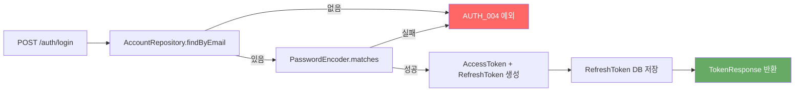
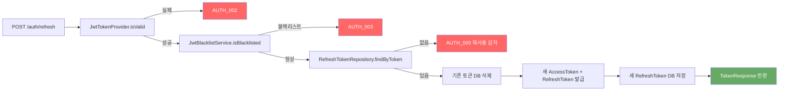
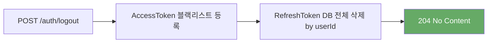
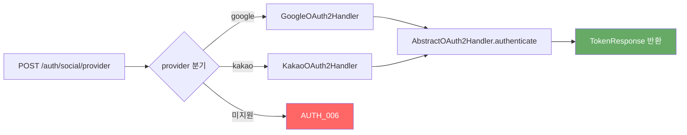
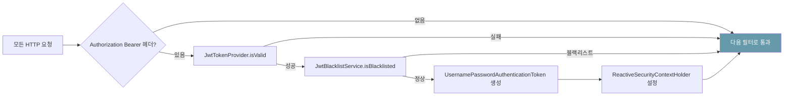

# 인증 및 계정 API 설계

**날짜:** 2026-05-14  
**범위:** 인증(Auth) + 계정(Account) HTTP 레이어 전체 구현  
**상태:** 승인됨

---

## 1. 배경 및 목적

`account` 도메인의 Service, Repository, DTO, OAuth2 핸들러는 구현되어 있으나 HTTP 엔드포인트(Controller)가 없어 Swagger에 인증/계정 API가 노출되지 않는 상태다. 또한 `SecurityConfig`에 JWT 인증 필터가 연결되지 않아, 토큰을 발급해도 인증이 필요한 엔드포인트에서 실제 신원 확인이 불가능하다.

이 설계는 다음을 완성한다:
- 인증 Controller + AuthService (로그인 / 토큰 갱신 / 로그아웃 / 소셜 로그인)
- 계정 Controller (내 정보 조회 / 프로필 수정 / 탈퇴)
- JWT 인증 필터 (모든 요청에서 Bearer 토큰 검증 → SecurityContext 주입)

---

## 2. 파일 구조

### 신규 생성

```
account/
├── application/
│   ├── dto/
│   │   ├── LoginRequest.java          # 로그인 요청 (email, password)
│   │   ├── TokenResponse.java         # 토큰 응답 (accessToken, refreshToken)
│   │   └── SocialAuthRequest.java     # 소셜 로그인 요청 (accessToken)
│   └── service/
│       └── AuthService.java           # login / refresh / logout
└── controller/
    ├── AuthController.java            # POST /api/v1/auth/**
    └── AccountController.java         # GET|PUT|DELETE /api/v1/accounts/me

global/security/jwt/
└── JwtAuthenticationFilter.java       # Bearer 검증 → SecurityContext 주입
```

### 수정

```
global/config/SecurityConfig.java      # JWT 필터 연결, logout 경로 추가
```

---

## 3. API 엔드포인트

| 메서드 | 경로 | 인증 | 요청 | 응답 |
|--------|------|------|------|------|
| POST | `/api/v1/auth/register` | 불필요 | `RegisterRequest` | `ApiResponse<AccountResponse>` |
| POST | `/api/v1/auth/login` | 불필요 | `LoginRequest` | `ApiResponse<TokenResponse>` |
| POST | `/api/v1/auth/refresh` | 불필요 | `RefreshRequest` | `ApiResponse<TokenResponse>` |
| POST | `/api/v1/auth/logout` | Bearer(헤더 직접 읽기) | `LogoutRequest` | `ApiResponse<Void>` |
| POST | `/api/v1/auth/social/{provider}` | 불필요 | `SocialAuthRequest` | `ApiResponse<TokenResponse>` |
| GET | `/api/v1/accounts/me` | Bearer | — | `ApiResponse<AccountResponse>` |
| PUT | `/api/v1/accounts/me` | Bearer | `UpdateProfileRequest` | `ApiResponse<AccountResponse>` |
| DELETE | `/api/v1/accounts/me` | Bearer | — | `ApiResponse<Void>` |

---

## 4. 핵심 흐름

### 4-1. 로그인



### 4-2. 토큰 갱신 (Rotation)



### 4-3. 로그아웃



### 4-4. 소셜 로그인



### 4-5. JWT 인증 필터



토큰이 없거나 유효하지 않으면 필터를 통과시킨다. 이후 `authorizeExchange` 규칙에서 인증 여부를 최종 판단한다.

---

## 5. 신규 DTO 명세

### LoginRequest
```java
record LoginRequest(
    @NotBlank @Email String email,
    @NotBlank String password
) {}
```

### TokenResponse
```java
record TokenResponse(
    String accessToken,
    String refreshToken
) {}
```

### SocialAuthRequest
```java
record SocialAuthRequest(
    @NotBlank String accessToken  // OAuth2 provider access token
) {}
```

### RefreshRequest (익명 record 대신 명시적 DTO)
```java
record RefreshRequest(
    @NotBlank String refreshToken
) {}
```

### LogoutRequest
```java
record LogoutRequest(
    @NotBlank String refreshToken
) {}
```

---

## 6. AuthService 의존성

```
AuthService
  ├── AccountRepository       (이메일로 계정 조회)
  ├── RefreshTokenRepository  (토큰 저장 / 삭제)
  ├── PasswordEncoder         (비밀번호 검증)
  ├── JwtTokenProvider        (토큰 생성 / 파싱)
  └── JwtBlacklistService     (로그아웃 시 블랙리스트 등록)
```

---

## 7. JwtAuthenticationFilter 설계

- `WebFilter` 구현체
- `Authorization: Bearer <token>` 헤더에서 토큰 추출
- 유효하지 않거나 블랙리스트 토큰은 SecurityContext 설정 없이 다음 필터로 통과
- 유효한 토큰이면 `UsernamePasswordAuthenticationToken(userId, null, [ROLE_XXX])` 생성 후 `ReactiveSecurityContextHolder.withAuthentication()` 설정
- `SecurityConfig`에서 `addFilterAt(filter, SecurityWebFiltersOrder.AUTHENTICATION)` 연결

---

## 8. SecurityConfig 수정 사항

- `JwtAuthenticationFilter` Bean 주입 및 필터 체인 연결
- `/api/v1/auth/logout` 경로는 기존 `POST /api/v1/auth/**` permitAll 규칙으로 이미 열려 있으나, logout은 JWT가 있어야 userId를 알 수 있으므로 필터 통과 후 인증 정보를 활용

---

## 9. 에러 코드 매핑

| 상황 | ErrorCode |
|------|-----------|
| 이메일 없음 / 비밀번호 불일치 | `AUTH_004` |
| 만료된 토큰 | `AUTH_002` |
| 블랙리스트 토큰 | `AUTH_003` |
| Refresh Token 재사용 감지 | `AUTH_005` |
| 미지원 OAuth2 provider | `AUTH_006` |

---

## 10. 테스트 범위

- `AuthService` 단위 테스트: login 성공/실패, refresh Rotation, logout
- `JwtAuthenticationFilter` 단위 테스트: 유효 토큰, 만료 토큰, 블랙리스트 토큰, 헤더 없음
- `AuthController` / `AccountController` 통합 테스트 (Testcontainers): 전체 흐름 E2E
